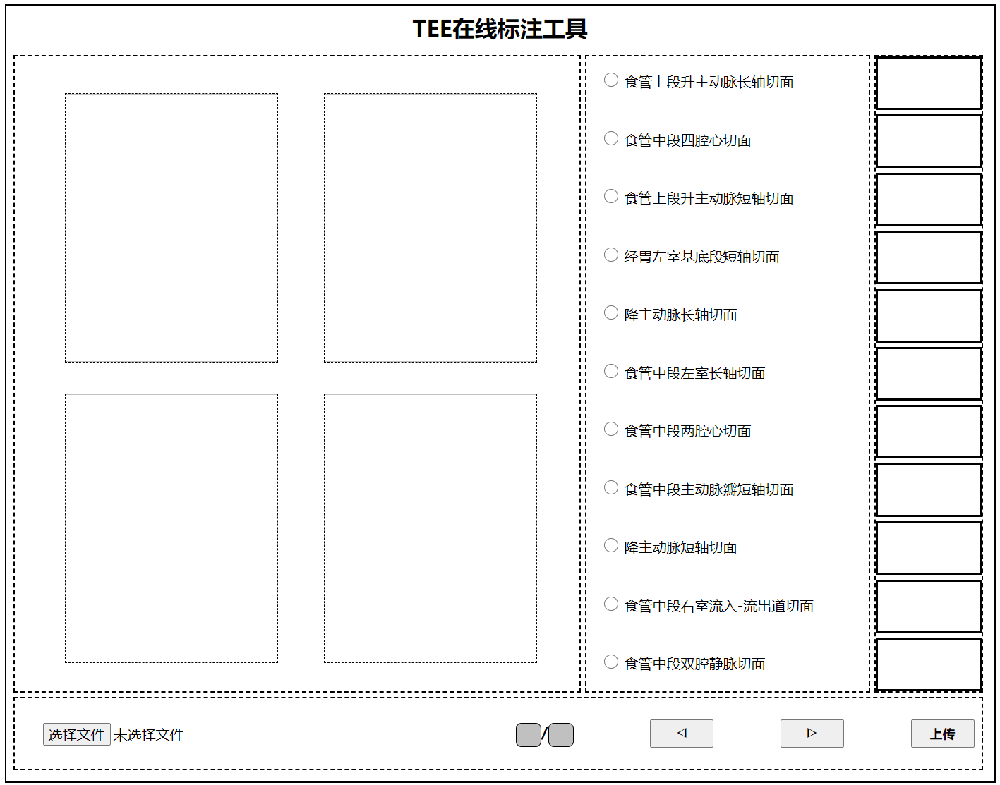
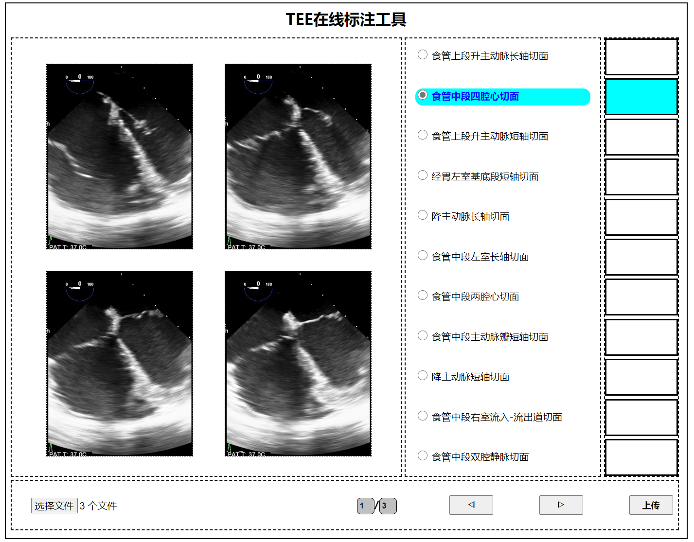
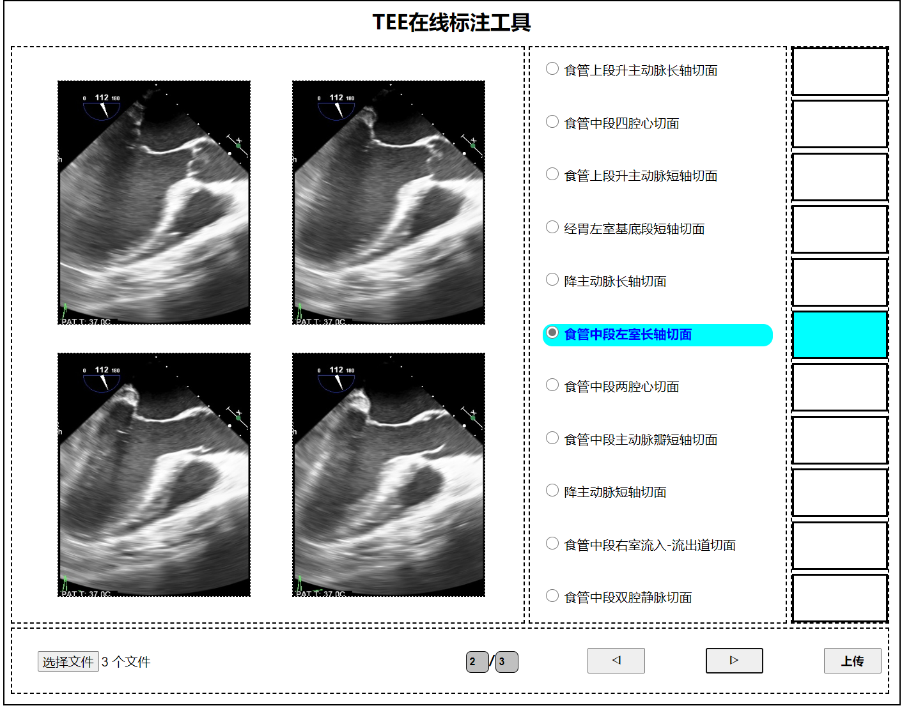

# TEE Web Labeling
## Introduction
A software for online TEE section annotation, provides suggested options through the model, and clicks the upload button to upload to the specified folder on the cloud server.

* Main Window


* Suggested options show


## Environment
```
pip install opencv-python
pip install pytorch
pip install torchvision
pip install werkzeug
pip install flask
pip install SimpleITK
pip install shutil
pip install numpy
```
## Directory Structure Description
```
.
├── cfg                 
│   ├── GT.json          //GT box
│   └── index.json       //Classification hashmap
├── data                 //Savedir       
│   ├── 0
│   ├── ...
│   └── 10
├── static             
│   ├── ccs
│   ├── imgs
│   └── js
├── models              
│   ├── net.py
│   └── __pycache__
├── model_weights  
│   └── resNet34     
├── readme.md
├── tmp
│   └── dcm             //temp file              
├── templates
│   └── index.html                   
└── utils               //Function definition
```
## Instructions for Use
### Run the web app
Run the following scripts.
```
python app.py
```
Open the ip address and conresponding port in the browser.



click ◁ ▷ to select a dcm file,this will give you a suggested options.
click 上传 to upload the dcm file to the specified folder.